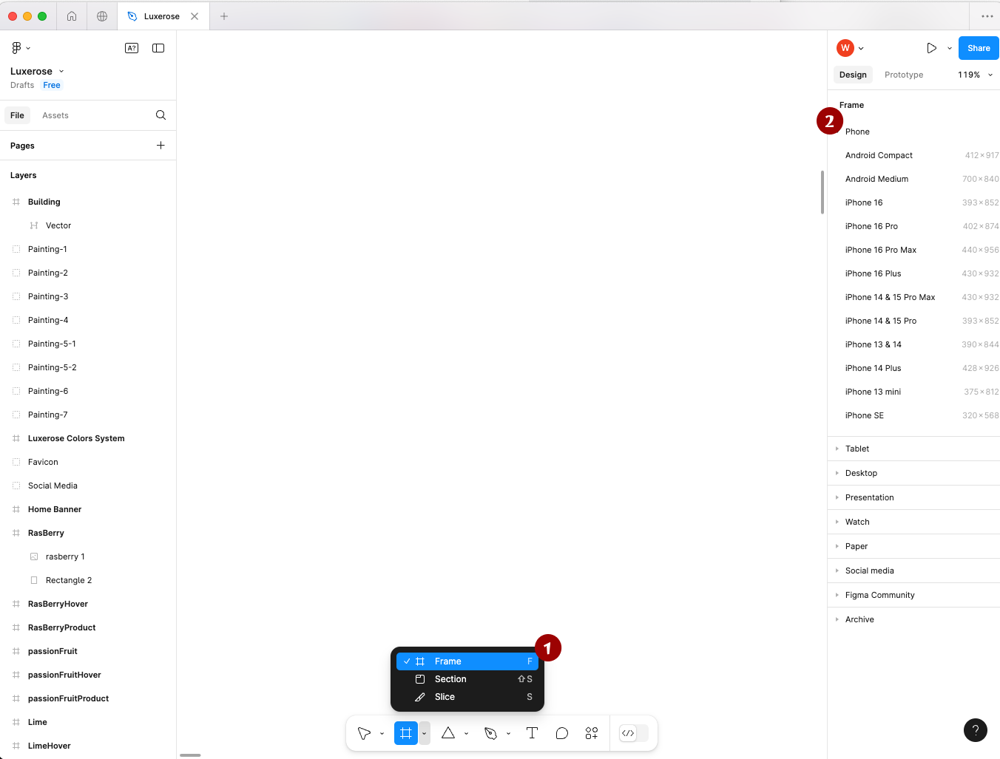
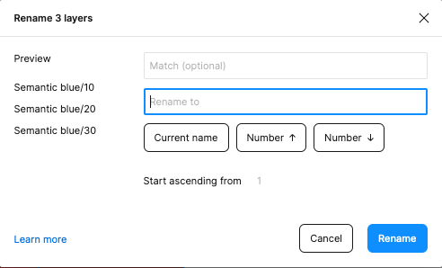

# Figma 常用快捷键

#### Frame

在Frame操作下，Figma提供默认的各种设备版本的Frame尺寸

**Frame 快捷键：**F

<figure><figcaption></figcaption></figure>

#### Group

需要把多个元素放在一个组里面

**Group 快捷键：**Command + G

#### 文本

**文本 快捷键：**T

**重命名对象名字 快捷键：**(Mac: ⌘ + R)

\*多对象重命名 快捷键：

1.  选中多对象 + (Mac: ⌘ + R)，会出现重命名窗口&#x20;

    <figure><figcaption></figcaption></figure>
2.  在 1. 的图片中输入新名字的修改规则，Match是确定匹配的是原名字的哪个部分，Number ↑意思是升序数字，后面一个是降序，Start ascending from 可以修改起始数字。更多方法需要自己探索

    <figure><figcaption></figcaption></figure>

<figure><figcaption></figcaption></figure>

#### 缩放

**缩放 快捷键：**k

**已经在缩放状态，撤回到只是移动状态：**ESC

#### 复制+拖拽

选中对象（需复制且拖拽出来的）+ （Mac: OPT / Windows: Alt) 直接拖就能实现

