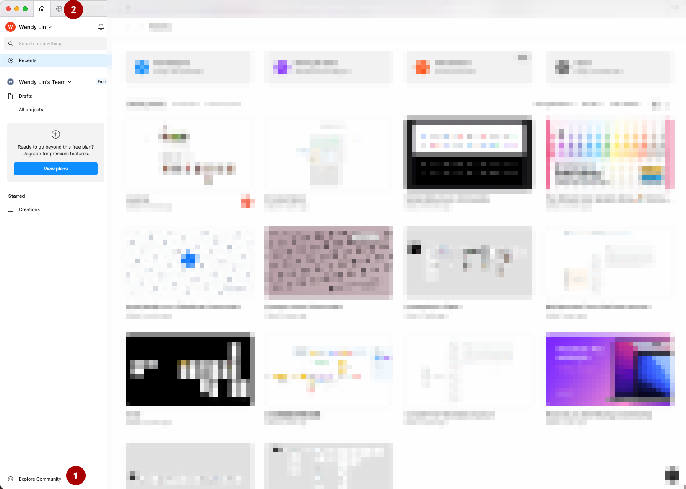

# Figma图片/图标资源

### Explore Community

一般搜索icons的包/插件，或者处理图片的插件以及一些通用的UI Kit

Explore Community就显示在第二个Tab是一个“地球”图表，如果找不到可以到用户的首页在页面左下角也有Explore Community。

<figure><figcaption></figcaption></figure>

### Pexels

真实摄影素材类型图片，非常适合用来做prototype，产品图和Banner非常好的资源库：[https://www.pexels.com/](https://www.pexels.com/)

